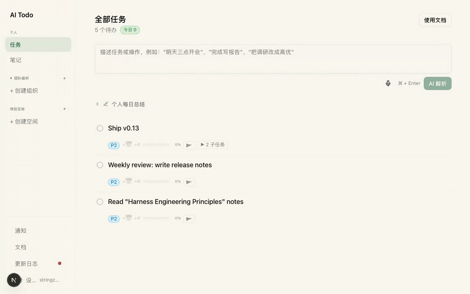
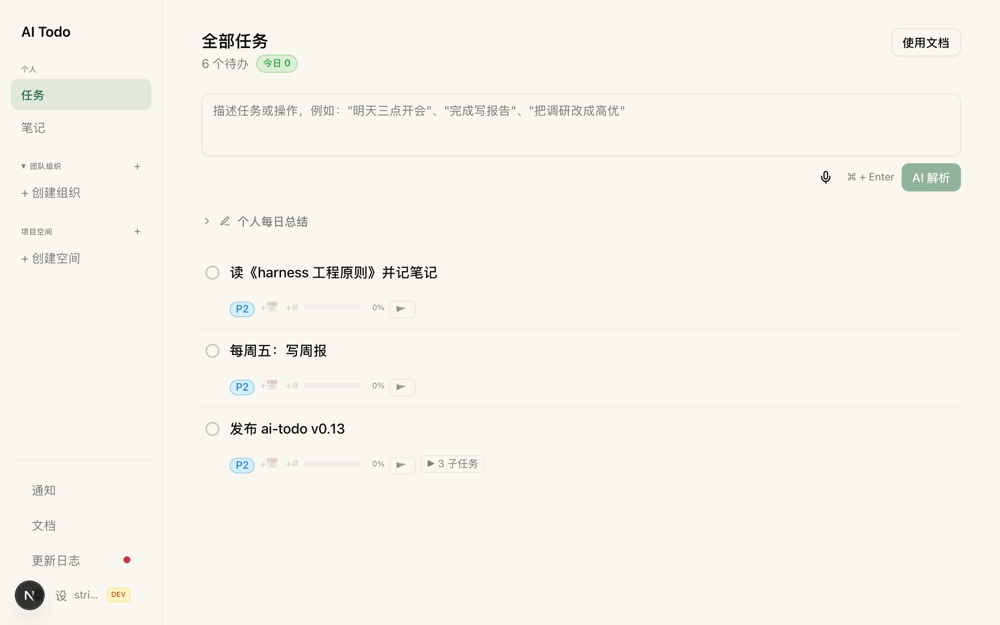

# AI Todo

**Natural-language task management for humans and AI agents.** Type one sentence — AI parses it into a structured task, shows you a preview, and executes only after you confirm.

[简体中文](README.zh-CN.md) | **English**



[](https://github.com/strzhao/ai-todo/actions/workflows/ci.yml)
[](LICENSE)
[](https://ai-todo.stringzhao.life)

## Why ai-todo

Most todo apps make you fill forms. ai-todo makes the input box the only interface:

- **One sentence, fully parsed** — "Move the weekly review to Friday 3pm and make it high priority" locates the right task, extracts date and priority, and shows a diff preview before anything changes.
- **Preview before execute** — every operation lands as a reviewable action first. No accidental edits, no lost tasks.
- **Deep structure** — unlimited parent/child nesting, cascading complete/delete, and any top-level task can be pinned into a shared project space with `@member` assignment and a Gantt view.

## Built for AI agents

ai-todo ships a CLI designed for agents like Claude Code — commands are discovered dynamically from the server, and **every output is pure JSON** (no scraping, no guessing):

```bash
npm install -g ai-todo-cli
ai-todo login
ai-todo tasks:list --filter today
ai-todo tasks:create --title "Ship v0.13"
ai-todo tasks:add-log --id <id> --content "progress note"
```

Install the Claude Code skill and task-related intents route straight into ai-todo:

```bash
npx skills add strzhao/ai-todo-cli
```

CLI source: [`apps/cli`](apps/cli) in this monorepo (published to npm as `ai-todo-cli`)

## Quickstart

1. Open [ai-todo.stringzhao.life](https://ai-todo.stringzhao.life) and sign in
2. Press `Cmd/Ctrl + K` to focus the AI input
3. Describe the task or operation in one sentence, review the preview, confirm

> Note: the UI is currently Chinese-only; the AI parser understands English input fine, and an English UI is on the roadmap.

### Self-hosting

Next.js 16 monorepo (`apps/web` + `apps/cli`). You provide: a Postgres database (`POSTGRES_URL`), a DeepSeek API key for NL parsing (`DEEPSEEK_API_KEY`), and an OIDC provider (`AUTH_ISSUER`; set `AUTH_DEV_BYPASS=true` for local development). Then:

```bash
npm install && npm run dev   # http://localhost:4000
```

## Features

- Natural-language create / update / complete / delete / add-progress, with batch operations in one input
- Preview-and-confirm for every action
- Unlimited task nesting; completing a parent completes the subtree
- Project spaces: pin any top-level task, invite members, assign with `@email`, Gantt timeline
- `Cmd/Ctrl + K` focus input · `Cmd/Ctrl + Enter` parse · focus a parent task to default-create subtasks



## How it compares

|                                   | ai-todo            | [Taskosaur](https://github.com/Taskosaur/Taskosaur) | [TaskFlow AI](https://github.com/webcodelabb/taskflow-ai) |
| --------------------------------- | ------------------ | --------------------------------------------------- | --------------------------------------------------------- |
| Input paradigm                    | NL-first, one box  | conversational AI in-app                            | NL → daily plans                                          |
| Preview before execute            | ✅ per-action diff | —                                                   | —                                                         |
| Dedicated agent CLI (pure JSON)   | ✅                 | —                                                   | —                                                         |
| Claude Code skill                 | ✅                 | —                                                   | —                                                         |
| Unlimited nesting + shared spaces | ✅                 | project-based                                       | plan-based                                                |

## Roadmap

- [ ] i18n (English UI)
- [ ] More agent integrations (MCP server)
- [ ] Mobile PWA polish

## Contributing

Issues and PRs are welcome — see [CONTRIBUTING.md](CONTRIBUTING.md). The API surface is documented in [`documents/api/`](documents/api/).

## License

[MIT](LICENSE) © 2026 strzhao
