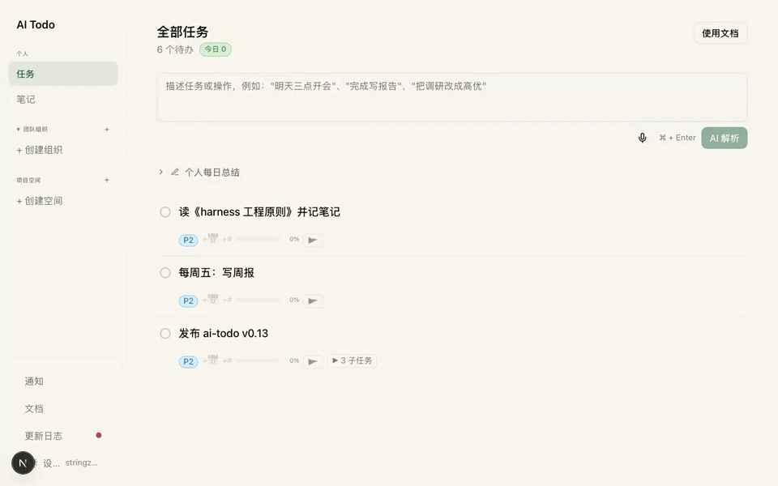

# AI Todo

**给人和 AI agent 用的自然语言任务管理。** 说一句话 —— AI 解析成结构化任务，先给你看预览，确认后才执行。

**简体中文** | [English](README.md)



[](https://github.com/strzhao/ai-todo/actions/workflows/ci.yml)
[](LICENSE)
[](https://ai-todo.stringzhao.life)

## 为什么是 ai-todo

多数待办应用要你填表单。ai-todo 只留一个输入框：

- **一句话全解析** —— 「把写周报改成高优先级，明天下午三点截止」自动定位任务、提取日期和优先级，变更前先给你看 diff 预览。
- **先预览再执行** —— 所有操作先落成可审阅的动作，确认才生效。不误改、不丢任务。
- **深层结构** —— 无限层级父子嵌套、级联完成/删除；任何顶层任务可置顶为共享项目空间，支持 `@邮箱` 指派和甘特图。

## 为 AI agent 而生

ai-todo 自带专为 agent（如 Claude Code）设计的 CLI —— 命令从服务端动态发现，**所有输出都是纯 JSON**（不用爬页面、不用猜格式）：

```bash
npm install -g ai-todo-cli
ai-todo login
ai-todo tasks:list --filter today
ai-todo tasks:create --title "发布 v0.13"
ai-todo tasks:add-log --id <id> --content "进展记录"
```

安装 Claude Code 技能后，任务相关意图自动路由到 ai-todo：

```bash
npx skills add strzhao/ai-todo-cli
```

CLI 仓库：[strzhao/ai-todo-cli](https://github.com/strzhao/ai-todo-cli)

## 30 秒上手

1. 打开 [ai-todo.stringzhao.life](https://ai-todo.stringzhao.life)，登录
2. `Cmd/Ctrl + K` 聚焦 AI 输入框
3. 一句话描述任务或操作，确认预览无误后执行

### 自托管

Next.js 16 monorepo（`apps/web`）。你需要准备：Postgres 数据库（`POSTGRES_URL`）、DeepSeek API key（`DEEPSEEK_API_KEY`）、OIDC 认证服务（`AUTH_ISSUER`；本地开发可设 `AUTH_DEV_BYPASS=true` 跳过）。然后：

```bash
npm install && npm run dev   # http://localhost:4000
```

## 主要功能

- 自然语言创建 / 更新 / 完成 / 删除 / 添加进展，支持一句话批量操作
- 一切操作先预览后执行
- 任务无限层级嵌套；完成父任务自动完成全部子任务
- 项目空间：置顶任意顶层任务、邀请成员、`@邮箱` 指派、甘特图查看时间分布
- `Cmd/Ctrl + K` 聚焦输入 · `Cmd/Ctrl + Enter` 解析 · 聚焦父任务后输入默认创建子任务


## 横向对比

|                           | ai-todo           | [Taskosaur](https://github.com/Taskosaur/Taskosaur) | [TaskFlow AI](https://github.com/webcodelabb/taskflow-ai) |
| ------------------------- | ----------------- | --------------------------------------------------- | --------------------------------------------------------- |
| 输入范式                  | NL-first 单输入框 | 应用内对话式 AI                                     | NL → 每日计划                                             |
| 先预览再执行              | ✅ 逐动作 diff    | —                                                   | —                                                         |
| Agent 专用 CLI（纯 JSON） | ✅                | —                                                   | —                                                         |
| Claude Code 技能          | ✅                | —                                                   | —                                                         |
| 无限层级 + 共享空间       | ✅                | 项目制                                              | 计划制                                                    |

## Roadmap

- [ ] i18n（英文界面）
- [ ] 更多 agent 集成（MCP server）
- [ ] 移动端 PWA 打磨

## 参与贡献

欢迎 issue 和 PR —— 见 [CONTRIBUTING.md](CONTRIBUTING.md)。API 文档在 [`documents/api/`](documents/api/)。

## 许可

[MIT](LICENSE) © 2026 strzhao
